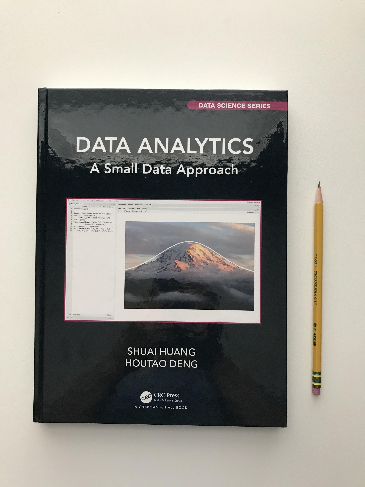
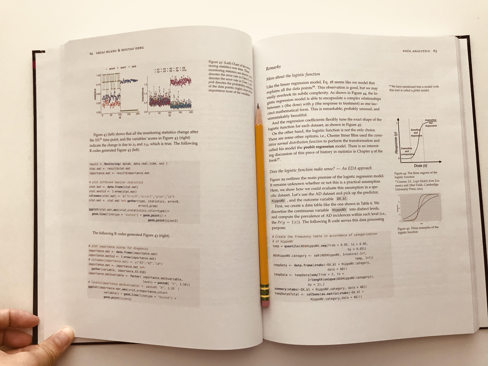
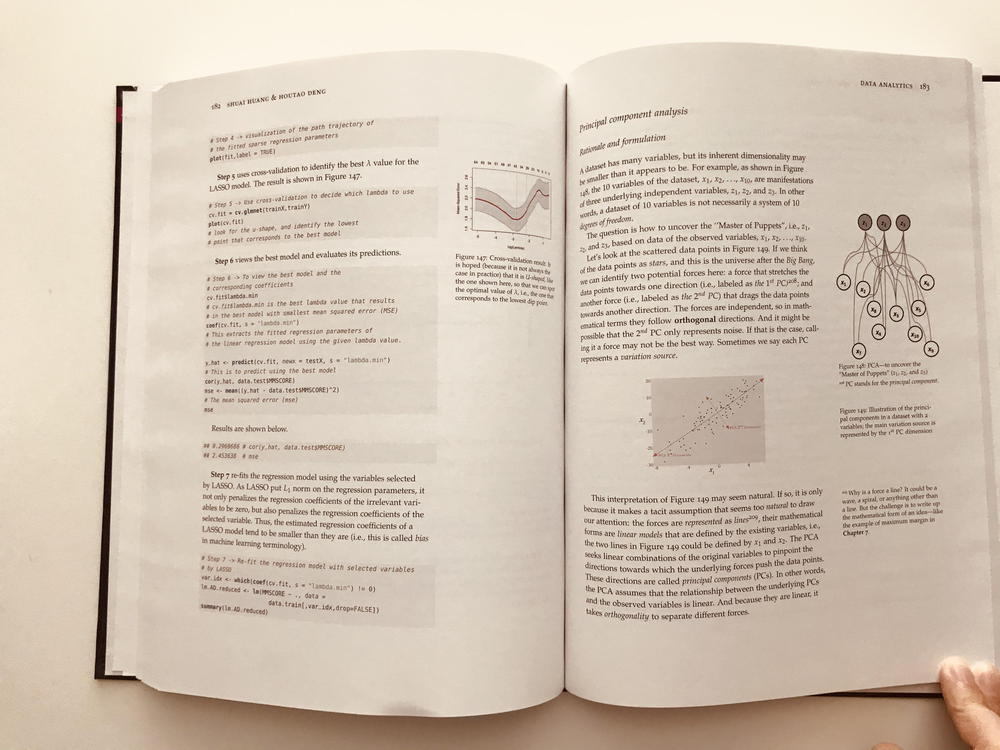
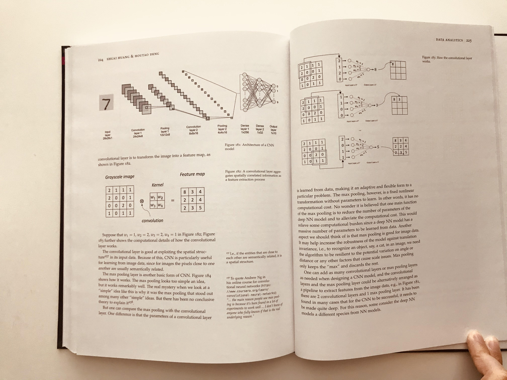

  
  
  
  

- Suitable for introductory data analytics courses. 
- Emphasize storytelling and holistic understanding
	* to build trust and transparency for trustworthy data science and AI applications.
- Build confidence by rigorous training and simple learning strategies
	* many small datasets to guide students to work out pencil solutions and compare with established R/Python packages. 
- To train an AI-enabled workforce
	* whose members understand the principles and intuitions of data science and AI tools
	* can communicate about them in effective language
	* can participate in the development of productive and responsible AI tools in various ways.
- Free online version [here](http://dataanalyticsbook.info/).
- Codes (R and Python) and datasets available at [github](https://github.com/analyticsbook/book).
- Solution manual (for instructors) available at [here](https://www.routledge.com/Data-Analytics-A-Small-Data-Approach/Huang-Deng/p/book/9780367609504).   
- Buy the book [here](https://www.routledge.com/Data-Analytics-A-Small-Data-Approach/Huang-Deng/p/book/9780367609504) or through [Amazon.com](https://www.amazon.com/Data-Analytics-Approach-Chapman-Science/dp/0367609509).
