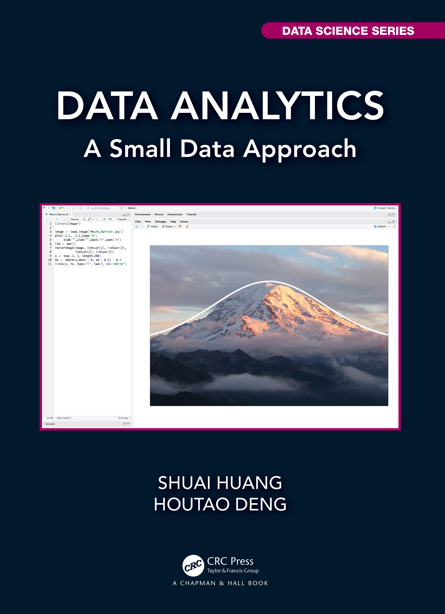

  

- This book is suitable for an introductory data analytics course to help students understand some main statistical learning models. 
- It has many small datasets to guide students to work out pencil solutions of the models and then compare with results obtained from established R packages. 
- As data science practice is a process that should be told as a story, in this book there are many course materials about exploratory data analysis, residual analysis, and flowcharts to develop and validate models and data pipelines.
- All the codes (R and Python) and datasets used in the book are available at: https://github.com/analyticsbook/book
- A draft of the book could be downloaded in the data analytics course [website](http://analytics.shuaihuang.info/), together with the lecture notes and R codes. 
- The book in print is forthcoming and you can buy the book [here](https://www.routledge.com/Data-Analytics-A-Small-Data-Approach/Huang-Deng/p/book/9780367609504) or through [Amazon.com](https://www.amazon.com/Data-Analytics-Approach-Chapman-Science/dp/0367609509).
