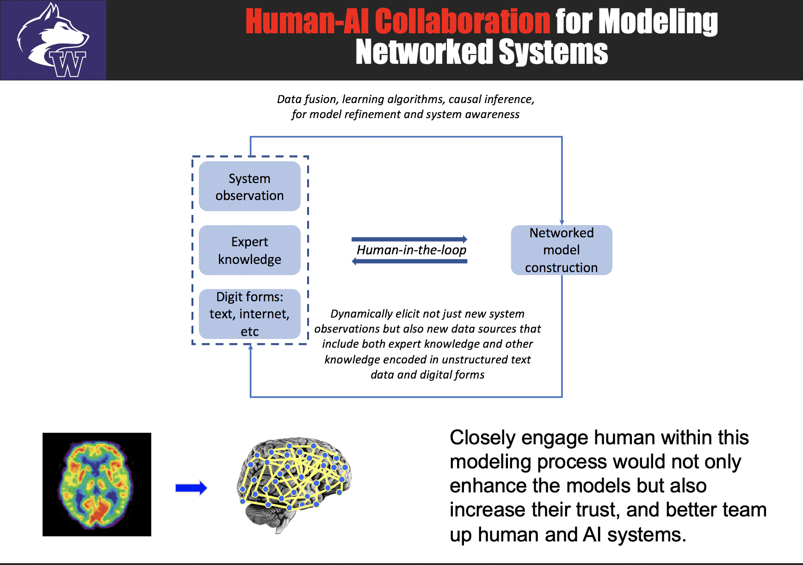
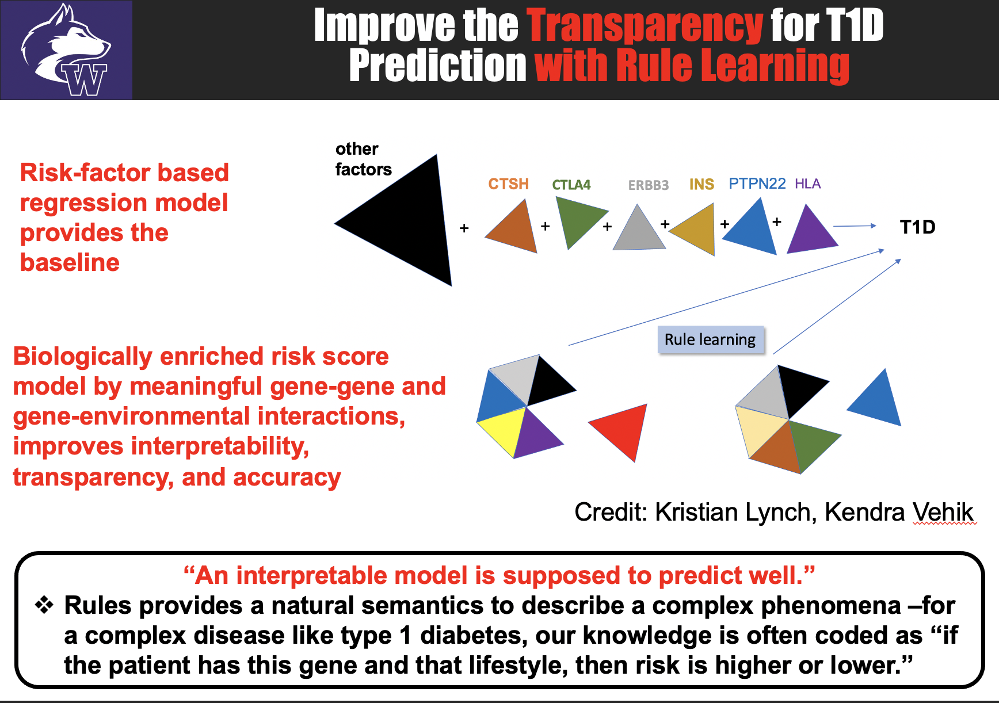
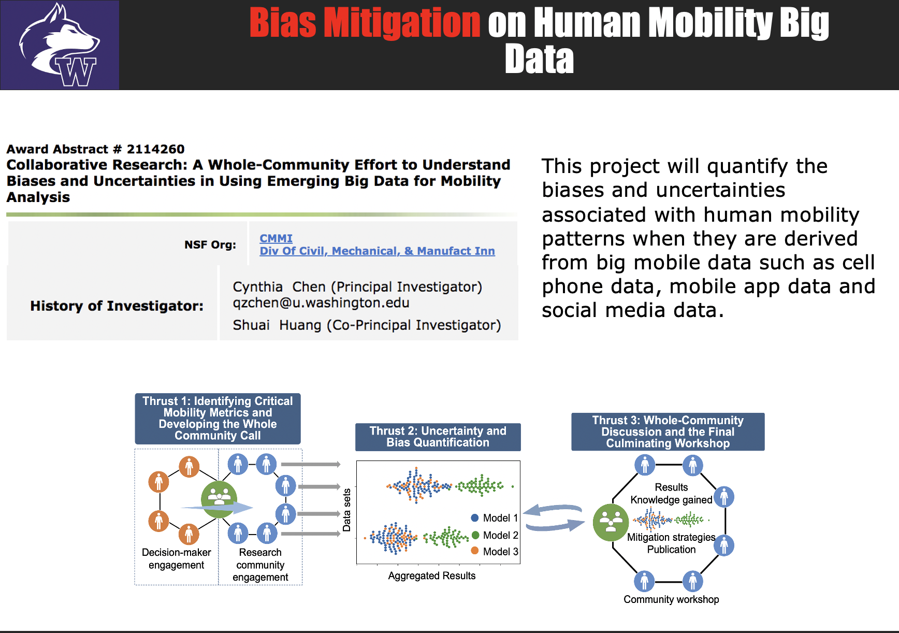
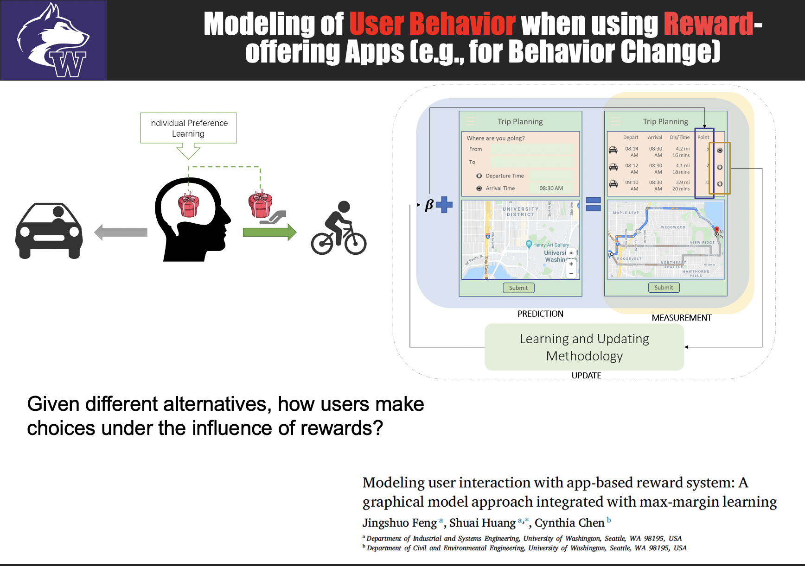

Our research focuses on the identification and characterization of some novel statistical nature of modern complex systems that would lead to better modeling, prediction, and uncertainty quantification. We have studied complex systems that range from manufacturing, healthcare, and transportation. Examplary projects include

- Quality Science for Networked Systems: we develop methodologies for modeling, monitoring, anomaly detection, diagnosis, and prognosis of [complex networked systems](https://www.tandfonline.com/doi/abs/10.1080/24725854.2017.1301692). These networked systems are continuously monitored by a distributed structure of sensors. The statistical uncertainty, interdependency of the variables and the underlying causality are complex and can't be sufficiently characterized by classic multivariate statistical models. Examples of these networked systems are abundant in manufacturing, healthcare, and any application that implementes internet of things (IoT).
- Multi-modal Data Fusion: We develop machine learning models to integrate heterogeneous datasets such as neuroimaging, genomics, proteomics, laboratory tests, demographics, and clinical variables, for facilitating scientific [discoveries](https://ieeexplore.ieee.org/abstract/document/8888210) in biomedical research and better [decision making](https://ieeexplore.ieee.org/abstract/document/9413157) in clinical practices.
- User Behavioral Modeling: We develop user behavioral and choice-making models (i.e., under rewards) to characterize how users interact with an APP system and make decisions. We also develop methods to detect [anomalous users](https://www.tandfonline.com/doi/abs/10.1080/24725854.2023.2279080) (the so-called "bad actors") from their behavioral patterns.
- Personalized Machine Learning Models: We develop the [collaborative learning framework](https://pubsonline.informs.org/doi/10.1287/ijds.2024.0029) that can achieve multi-level characterization of a population: it builds a canonical structure shared by all individuals and the individual models together, extending the traditional mixed effect models to a more fine-grained statistical characterization of the population heterogeneity, while also borrowing strength from modern optimization tools to generate robust and generalizable personalized models even under sparse individual data and uneven distribution of samples across individuals.
- Digital twin: We develop digital twin models that are mostly inspired by healthcare applications (such as patient monitoring and [lifestyle management](https://www.tandfonline.com/doi/abs/10.1080/24725579.2019.1640814)) but can also be used in many other fields such as [transportation](https://www.sciencedirect.com/science/article/pii/S0191261524001887), marketing, [pricing](https://www.sciencedirect.com/science/article/abs/pii/S0968090X20307191), to name a few.

<!---
Our research is driven by challenging data analytics and AI problems, emphasizes innovation in machine learning and AI modeling for [complex systems and processes](https://www.sciencedirect.com/science/article/abs/pii/S1053811909014281) in the [connected world](https://ieeexplore.ieee.org/abstract/document/8169076), automates the [integration of human](https://ieeexplore.ieee.org/abstract/document/8304661) with these data-driven learning systems, and targets [interpretable and explainable](https://www.sciencedirect.com/science/article/abs/pii/S1532046421000204) decision-makings. 

We develop methodologies for modeling, monitoring, anomaly detection, diagnosis, and prognosis of [complex networked systems](https://www.tandfonline.com/doi/abs/10.1080/24725854.2017.1301692), such as brain connectivity networks, manufacturing processes, enterprise systems, cyber-physics systems, and Internet of Things (IoT). 

 

Working with domain experts, these data-driven learning and decision-making models are applied to a range of applications such as healthcare ([precision medicine](https://www.mpowercare.org), [disease research](https://link.springer.com/article/10.1007/s41666-020-00085-1), [biomarker discovery](https://www.tandfonline.com/doi/abs/10.1080/24725579.2018.1496494)), neuroscience, system biology, [IoT](http://proceedings.mlr.press/v108/huo20a.html), [monitoring and anomaly detection](https://www.tandfonline.com/doi/abs/10.1080/24725854.2017.1301692), and [transportation](https://ieeexplore.ieee.org/abstract/document/9292970) ([mobility data analysis](https://sites.uw.edu/bigdata4mobility/), [user behavior modeling](https://www.sciencedirect.com/science/article/abs/pii/S0968090X20307191) for smart transportation demand management (TDM)).

**Example Projects**

*Collaborative Construction of Models for Networked Systems by Human-AI Collaboration*

 

  

 

*Mitigate Data Disparities (such as minority bias, aggregation bias) by Collaborative Learning*

 

  

 

*Improve the Interpretability, Transparency, and Fairness of Risk Prediction of Type 1 Diabetes by Rule-based Methods*

 

  

 

*Understand the Bias and Uncertainties in Human Mobility Data*

*Check out our project [website](https://sites.uw.edu/bigdata4mobility/)*

 

  

 

*Modeling of User Choice Behavior and Interactions with Reward-offering AI Systems*

 

  

*Other examples from my previous website*

- Brain connectivity modeling using Neuroimaging data ([link](https://sites.google.com/site/shuaihuang28/research/research-thrust-1/brain-connectivity?authuser=0))
- Towards mechanistic understanding of type 1 diabetes ([link](https://sites.google.com/site/shuaihuang28/research/research-thrust-1/t1d?authuser=0))
- Smart monitoring of complex diseases ([link](https://sites.google.com/site/shuaihuang28/research/thrust-2/smart-monitoring?authuser=0))
- Integration with mHealth technology ([link](https://sites.google.com/site/shuaihuang28/research/thrust-2/mpower?authuser=0))

___

**Research Thrust 1: Mechanistic Understanding of Complex System Problems**

*Examples*

- Brain connectivity modeling using Neuroimaging data ([link](https://sites.google.com/site/shuaihuang28/website-builder/thrust-1/brain-c))
- Towards mechanistic understanding of type 1 diabetes ([link](https://sites.google.com/site/shuaihuang28/website-builder/thrust-1/t1d))
- User-app interaction; user decision-making process modeling
- Characterization of bias and uncertainties of human mobility patterns derived from mobile devices

___
**Research Thrust 2: Translation of Mechanistic Understanding into Decision Makings**

*Examples*

- Smart monitoring of complex diseases ([link](https://sites.google.com/site/shuaihuang28/website-builder/thrust-2/smart-monitoring))
- Integration with mHealth technology ([link](https://sites.google.com/site/shuaihuang28/website-builder/thrust-2/mpower))

___
**Research Thrust 3: Applications**

*Examples*

- Precision medicine (disease progression modeling, patient monitoring by wearable devices, personalized prediction models)
- Neuroscience and brain diseases (brain connectivity modeling, biomarker discovery, health index construction)
- IoT (context-aware computing, uncertainty quantification, adaptive monitoring and cost-effective sensing)
- Prognostics and health management (PHM) 

-->

  

**Acknowledgment for Funding Support**
- National Science Foundation (CMMI-1505260, CMMI-1536398, CMMI-1824623, CCF-1715027, CIS-2114260)
- Breakthrough T1D (formerly known as the Juvenile Diabetes Research Foundation)
- NIH
- AHRQ
- DARPA WASH; DARPA D3M 
- AFOSR DDDAS
- USDOT
- Byrd Alzheimer's Institute 
- Royalty Research Foundation
- Helmsley Foundation
- Amazon
- Meta
