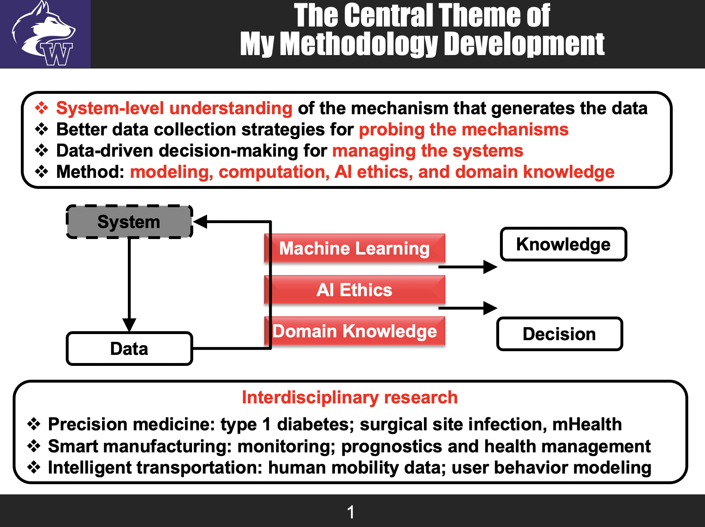

Shuai’s research is driven by challenging data analytics problems, emphasizes innovation in statistics for problem solving, and targets system-level decision making and quality improvement. He develops methodologies for modeling, monitoring, diagnosis, and prognosis of complex networked systems, such as brain connectivity networks, social networks, cyber-physics systems, and manufacturing systems. He also develops novel statistical and data mining models to integrate the massive heterogeneous datasets such as neuroimaging, genomics, proteomics, laboratory tests, demographics, and clinical variables, for facilitating scientific discoveries in biomedical research and better decision making in clinical practices.

___

**Research Thust 1:**

